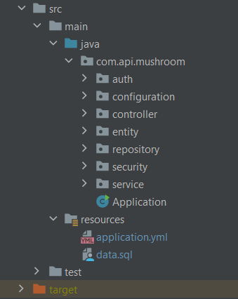
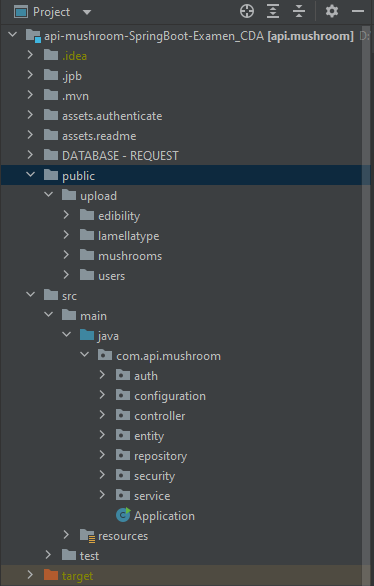
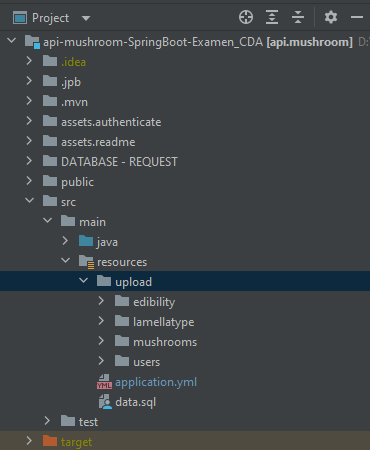

# API - SPRING BOOT - EXAMEN

**Pourquoi spring boot:**

Spring Boot facilite la configuration et le démarrage de projet en générant un squelette prêt à l'emploi avec les dépendances et la configuration souhaitées.

# DEMARRER UN NOUVEAU PROJET

Initialiser le projet avec le générateur https://start.spring.io/

* Project : spécifier le nom du projet et le nom du package de base.

* Language : choisir le langage de programmation parmi Java, Kotlin ou Groovy.

* Spring Boot Version : sélectionner la version spécifique de Spring Boot que vous souhaitez utiliser.

* Project Metadata : ajouter des informations supplémentaires sur le projet, telles que la description, le nom du groupe, l'artefact, etc.

* Packaging : choisir le type de packaging pour votre projet, tel que Jar ou War.

* Java : spécifier la version de Java que vous souhaitez utiliser (par exemple, Java 11 ou Java 17).

* Dependencies : C'est l'une des options les plus importantes, car cela permet de sélectionner les dépendances spécifiques que vous souhaitez inclure dans votre projet Spring Boot. Par exemple, vous pouvez choisir les dépendances pour Spring Web, Spring Data JPA, Spring Security, Thymeleaf, etc.

* Packaging Options : spécifier des options supplémentaires de packaging pour votre projet, telles que le nom du fichier jar, la version du projet, les propriétés de manifeste, etc.

* Spring Boot DevTools : offre des fonctionnalités de rechargement automatique pour le développement.

* Spring Boot Actuator : fournit des endpoints pour la surveillance et la gestion de l'application.


# LES DEPENDANCES

- Spring Web Web : Build web, including RESTful, applications using Spring MVC. Uses Apache Tomcat as the default embedded container.
- Lombok Developer Tools : C'est une bibliothèque Java qui aide à réduire le code et éviter les répétitions comme les getters, setters, etc.
- Spring Data JPA SQL : Utiliser Spring Data et Hibernate pour persister les données dans les magasins SQL avec l'API Java Persistence.
- Spring Boot DevTools Developer Tools : Fournit des redémarrages rapides des applications, LiveReload et des configurations pour une expérience de développement améliorée.
- OAuth2 Client Security : Intégration de Spring Boot pour les fonctionnalités du client Spring Security OAuth2/OpenID Connect. (cas d'un "login with Google" par exemple)
- Spring Security Security : Cadre d'authentification et de contrôle d'accès hautement personnalisable pour les applications Spring.
- MySQL Driver SQL : Pilote JDBC pour MySQL.


# LA STRUCTURE




# STOCKAGE DES ASSETS
Dans un projet Spring Boot, vous pouvez stocker les fichiers statiques, y compris les images, dans différents endroits en fonction de vos besoins spécifiques.

1. Création d'un dossier `public` à la racine du projet pour les fichiers d'upload , celui-ci sera accessible sans restriction `http://localhost:8080/upload/`;.



2. Création d'un serveur de fichier accessible via une méthode GET. Le dossier `upload` est créé dans `src/main/resources`.



Controller
````java

@RestController
@RequiredArgsConstructor
@CrossOrigin
@RequestMapping("api/v1/file/upload")
public class ImageController {

   // Via l'annotation @RequiredArgsConstructor Lombok va générer un constructeur avec un paramètre pour chaque constante (final)
   private final ImageService imageService;

    /* Donc on n'a pas besoin d'injecter le service de cette autre manière
    @Autowired
    public ImageController(ImageService imageService) {
        this.imageService = imageService;
    }
     */

   // TELECHARGEMENT DE FICHIER: Cette méthode renvoi vers le client le fichier demandé.
   // Est demandé en premiere paramètre le nom du sous-dossier d'upload (rubrique) et en deuxième paramètre le nom du fichier recherché.
   // le serveur retourne la réponse avec les données de l'image et les en-têtes
   @GetMapping("/{pathName}/{imageName}")
   public ResponseEntity<byte[]> getImage(@PathVariable String pathName, @PathVariable String imageName) throws IOException {
      return imageService.getImage(pathName, imageName);
   }
}
````

Service
````java
@Service
public class ImageService {

   public ResponseEntity<byte[]> getImage(String pathName, String imageName) throws IOException {
      // Construire le chemin d'accès complet vers l'image demandée
      String fullImagePath = "upload/" + pathName + "/" + imageName;

      // Obtenir le chemin d'accès complet du fichier image depuis le répertoire src/main/resources
      ClassPathResource classPathResource = new ClassPathResource(fullImagePath);
      Path imageFilePath = classPathResource.getFile().toPath();

      // Vérifier si le fichier existe
      if (Files.exists(imageFilePath)) {
         // Lire le contenu du fichier image
         byte[] imageBytes = Files.readAllBytes(imageFilePath);

         // Définir le type de contenu (Content-Type) de la réponse
         String contentType = determineContentType(imageFilePath);

         // Construire les en-têtes de la réponse avec le type de contenu
         HttpHeaders headers = new HttpHeaders();
         headers.setContentType(MediaType.valueOf(contentType));

         // Retourner la réponse avec les données de l'image et les en-têtes
         return new ResponseEntity<>(imageBytes, headers, HttpStatus.OK);
      } else {
         // Si le fichier image n'existe pas, retourner une réponse 404 (Non trouvé)
         return new ResponseEntity<>(HttpStatus.NOT_FOUND);
      }
   }

   // Méthode pour déterminer le type de contenu (Content-Type) de l'image
   private String determineContentType(Path filePath) throws IOException {
      String contentType;
      try {
         contentType = Files.probeContentType(filePath);
      } catch (IOException e) {
         // En cas d'erreur lors de la détermination du type de contenu, on utilise un type par défaut
         contentType = "application/octet-stream";
      }
      return contentType;
   }
}

````


# SECURITE

https://docs.spring.io/spring-security/reference/servlet/authorization/authorize-http-requests.html

Gérer les autorisations sur des routes (endpoints) en utilisant Spring Security. Spring Security est un module de sécurité puissant qui permet de définir des règles d'accès et de contrôler l'accès aux ressources de votre application.

Dans le contexte de Spring Security (la gestion de la sécurité dans les applications Spring), lorsque vous vous connectez avec succès en tant qu'utilisateur authentifié, vous obtenez un "jeton" (ou "token") d'accès qui vous permet d'accéder à certaines ressources protégées ou d'exécuter certaines actions spécifiques. Dans ce cas, vous pouvez dire que l'accès à ces ressources ou actions a été "granted" (accordé) à l'utilisateur.


```java
http
    .authorizeHttpRequests((authorize) -> authorize
        .requestMatchers("/resource/**").hasAuthority("USER")
        .anyRequest().authenticated()
    )
```

```java
http
    .authorizeHttpRequests((authorize) -> authorize
        .requestMatchers(HttpMethod.GET).hasAuthority("read")
        .requestMatchers(HttpMethod.POST).hasAuthority("write")
        .anyRequest().denyAll()
    )
```

````
import static jakarta.servlet.DispatcherType.*;

import static org.springframework.security.authorization.AuthorizationManagers.allOf;
import static org.springframework.security.authorization.AuthorityAuthorizationManager.hasAuthority;
import static org.springframework.security.authorization.AuthorityAuthorizationManager.hasRole;

@Bean
SecurityFilterChain web(HttpSecurity http) throws Exception {
	http
		// ...
		.authorizeHttpRequests(authorize -> authorize                                  (1)
            .dispatcherTypeMatchers(FORWARD, ERROR).permitAll() (2)
			.requestMatchers("/static/**", "/signup", "/about").permitAll()         (3)
			.requestMatchers("/admin/**").hasRole("ADMIN")                             (4)
			.requestMatchers("/db/**").access(allOf(hasAuthority('db'), hasRole('ADMIN')))   (5)
			.anyRequest().denyAll()                                                (6)
		);

	return http.build();
}
````


## Autorisations des demandes

- `permitAll` - La demande ne nécessite aucune autorisation et est un point de terminaison public ; Notez que dans ce cas, [`Authentication` n’est](https://docs.spring.io/spring-security/reference/servlet/authentication/architecture.html#servlet-authentication-authentication) jamais récupérée à partir de la session
- `denyAll` - La demande n’est en aucun cas autorisée; Notez que dans ce cas, `Authentication` n’est jamais récupérée à partir de la session
- `hasAuthority` - La demande nécessite que `Authentication` ait [un `GrantedAuthority`](https://docs.spring.io/spring-security/reference/servlet/authorization/architecture.html#authz-authorities) qui correspond à la valeur donnée
- `hasRole` - Un raccourci pour `hasAuthority` qui préfixe `ROLE_` ou tout ce qui est configuré comme préfixe par défaut
- `hasAnyAuthority` - La demande nécessite que `Authentication` ait un `GrantedAuthority` qui correspond à l’une des valeurs données
- `hasAnyRole` - Un raccourci pour `hasAnyAuthority` qui préfixe `ROLE_` ou tout ce qui est configuré comme préfixe par défaut
- `access` - La demande utilise ce `AuthorizationManager` personnalisé pour déterminer l’accès
- 

## HttpSécurité (Configuration par default)

https://docs.spring.io/spring-security/reference/servlet/configuration/java.html

Jusqu’à présent, notre [`WebSecurityConfig`](https://docs.spring.io/spring-security/reference/servlet/configuration/java.html#jc-hello-wsca) ne contient que des informations sur la façon d’authentifier nos utilisateurs. Comment Spring Security sait-elle que nous voulons exiger que tous les utilisateurs soient authentifiés ? Comment Spring Security sait-elle que nous voulons prendre en charge l’authentification basée sur les formulaires ? En fait, il existe une classe de configuration (appelée `SecurityFilterChain`) qui est appelée en arrière-plan. Il est configuré avec l’implémentation par défaut suivante :

```java
@Bean
public SecurityFilterChain filterChain(HttpSecurity http) throws Exception {
	http
		.authorizeRequests(authorize -> authorize
			.anyRequest().authenticated()
		)
		.formLogin(withDefaults())
		.httpBasic(withDefaults());
	return http.build();
}
```

La configuration par défaut (illustrée dans l’exemple précédent) :

- Garantit que toute demande adressée à notre application nécessite que l’utilisateur soit authentifié

- Permet aux utilisateurs de s’authentifier avec une connexion basée sur un formulaire

- Permet aux utilisateurs de s’authentifier avec l’authentification HTTP Basic

  

### Configuration perso avec JWT à modifier

````java
// src/main/java/com/api/mushroom/configuration/SecurityConfiguration.java

package com.api.mushroom.configuration;

import lombok.RequiredArgsConstructor;
import org.springframework.context.annotation.Bean;
import org.springframework.context.annotation.Configuration;
import org.springframework.security.authentication.AuthenticationProvider;
import org.springframework.security.config.annotation.method.configuration.EnableMethodSecurity;
import org.springframework.security.config.annotation.web.builders.HttpSecurity;
import org.springframework.security.config.annotation.web.configuration.EnableWebSecurity;
import org.springframework.security.config.http.SessionCreationPolicy;
import org.springframework.security.web.SecurityFilterChain;
import org.springframework.security.web.authentication.UsernamePasswordAuthenticationFilter;

@Configuration
@EnableWebSecurity
@EnableMethodSecurity
@RequiredArgsConstructor
public class SecurityConfiguration {

    private  final JwtAuthenticationFilter jwtAuthFilter;
    private final AuthenticationProvider authenticationProvider;

    @Bean
    public SecurityFilterChain securityFilterChain(HttpSecurity http) throws Exception {
        http
            .csrf()
            .disable()
            .authorizeHttpRequests()
                .requestMatchers("/api/v1/auth/**").permitAll()
                .anyRequest().authenticated()
            .and()
            .sessionManagement()
                .sessionCreationPolicy(SessionCreationPolicy.STATELESS)
                .and()
                .authenticationProvider(authenticationProvider)
                .addFilterBefore(jwtAuthFilter, UsernamePasswordAuthenticationFilter.class);
        return http.build();
    }

}
````


### Configurer la protection CSRF

Spring Security protège par défaut contre les attaques CSRF, le `CsrfToken` est nécessaire chaque fois qu’une demande est effectuée avec une [méthode HTTP non sécurisée](https://docs.spring.io/spring-security/reference/features/exploits/csrf.html#csrf-protection-idempotent), telle qu’un POST. En outre, il est nécessaire pour toute requête qui  restitue le jeton à la réponse, telle qu’une page Web avec une balise  <`<form>`> qui inclut une `<input>` masquée pour le jeton CSRF.

	@Configuration
	@EnableWebSecurity
	public class SecurityConfig {
	@Bean
	public SecurityFilterChain securityFilterChain(HttpSecurity http) throws Exception {
		http
			// ...
			.csrf(Customizer.withDefaults());
		return http.build();
		}
	}
https://docs.spring.io/spring-security/reference/servlet/exploits/csrf.html#servlet-csrf-configure-disable


### Cors

La méthode cors()  ajoutera le CorsFilter fourni par Spring au contexte de l'application, en contournant les vérifications d'autorisation pour les requêtes OPTIONS.

````java
 @Bean
    public SecurityFilterChain securityFilterChain(HttpSecurity http) throws Exception {
        http
            .cors()
            .disable()
            ...
            ;
        return http.build();
    }
````

#### Configuration CORS globale
````java
@Override
public void addCorsMappings(CorsRegistry registry) {
registry.addMapping("/**");
}
````

#### @CrossOrigin sur la méthode du contrôleur

````java
   public class MushroomCrudController {
    // Via l'annotation @RequiredArgsConstructor Lombok va génèrer un constructeur avec un paramètre pour chaque constante (final)
    final MushroomService mushroomService;

    // GET - Récupère un tableau d'enregistrement
    @CrossOrigin("http://example.com")
    @GetMapping(name = "/")
    public Iterable<MushroomEntity> getAll() {
        return mushroomService.getAll();
    }
````

#### @CrossOrigin sur une méthode de gestionnaire annoté @RequestMapping

````java
@RestController
@RequiredArgsConstructor
++ @CrossOrigin
@RequestMapping("api/v1/admin/mushroom")
public class MushroomCrudController {
   ...
}
````

### Configuration de spring boot

Configuration du fichier `application.yml`

### Création du model

création des classes d'Entité, elles représentent les tables de la BDD  les propriétes représentent les colonnes.

----- ALIMENTER AVEC UN EXEMPLE D'ENTITE

### Génération de la base de données

----- ALIMENTER AVEC UN EXEMPLE D'ENTITE

### Création de la couche DAO - repository

Création de la couche DAO =repository

----- ALIMENTER AVEC UN EXEMPLE D'ENTITE


### Couche de services

----- ALIMENTER AVEC UN EXEMPLE D'ENTITE


## MapStruct : Mapper les données d'une couche à l'autre

Le service ne connait pas le dto (donc on mappe le dto en service dans le controller ou le modelRepo en modelService dans le service)

Controler: Dto => Service: modelService => RepositorymodelRepository (entity)

#### Configuration de MapStruct `pom.xml`

````
<dependency>
			<groupId>org.mapstruct</groupId>
			<artifactId>mapstruct</artifactId>
			<version>1.5.5.Final</version>
		</dependency>

		<dependency>
			<groupId>org.mapstruct</groupId>
			<artifactId>mapstruct-processor</artifactId>
			<version>1.5.5.Final</version>
		</dependency>
````

### Les models

````
````


#### Créer l'interface de mappage

````
import com.api.mushroom.entity.UserEntity;
import org.mapstruct.Mapper;
import org.mapstruct.factory.Mappers;

@Mapper
public interface UserMapper {
    UserMapper INSTANCE = Mappers.getMapper(UserMapper.class);
    
    //@Mapping(target = "role", ignore = true) // Ignore le champ email
    UserGetDTO userEntityToUserGetDTO(UserEntity userEntity);
}
````


# Requête SQL avec Spring Boot et JPA


## Méthode avec @NamedQuery

ENTITY

````
// src/main/java/com/api/mushroom/entity/MushroomEntity.java


@NamedQuery(name = "MushroomEntity.findAllByVisibility", query = "SELECT m FROM MushroomEntity m WHERE m.visibility = :visibility")
public class MushroomEntity {
	...
}
````

````
// POUR REGROUPER PLUSIEURS REQUETES
@NamedQueries({
    @NamedQuery(name = "MushroomEntity.findAllByVisibility", query = "SELECT m FROM MushroomEntity m WHERE m.visibility = :visibility"),
    @NamedQuery(name = "MushroomEntity.findBySlug", query="SELECT m FROM MushroomEntity m WHERE m.slug=:slug")
})
````


CONTROLLER

````
// src/main/java/com/api/mushroom/controller/MushroomController.java

public class MushroomController {
    ...
    // GET - Retourne un tableau d'objets - liste de tous les enregistREments validé par l'administrateur pour la publication.
    @GetMapping(name = "/")
        public Iterable<MushroomEntity> findAllByVisibility() {
        return mushroomService.findAllByVisibility(true);
    }
    ...
}
````


PUIS **SOLUTION N° 1**

SERVICE

````
@Service
public class MushroomService {
	...
    // GET - Retourne un tableau d'objets - liste de tous les enregistrements validés par l'administrateur pour la publication.
    public List<MushroomEntity> findAllByVisibility(boolean isVisible) {
    	return mushroomJpaRepository.findAllByVisibility(isVisible);
    }
    ...
}
````

REPOSITORY

````
// src/main/java/com/api/mushroom/repository/MushroomJpaRepository.java

@Repository
public interface MushroomJpaRepository extends JpaRepository<MushroomEntity, Long> {

	List<MushroomEntity> findAllByVisibility(boolean visibility);
	
	...
}
````


OU **SOLUTION N° 2**

````
Query<MushroomEntity> query = session.createNamedQuery("MushroomEntity.findAllIsVisibility", MushroomEntity.class);
query.setParameter("visibility", true");
MushroomEntity result = query.getSingleResult();
````

OU 

````
NativeQuery query = session.getNamedNativeQuery("MushroomEntity.findAllIsVisibility");
query.setParameter("visibility", true");
MushroomEntity result = (MushroomEntity) query.getSingleResult();
````

OU encore avec **l'EntityManager** dans le service sans utiliser l'interface repository

SERVICE

````
@Service
public class MushroomService {

	EntityManager entityManager; // Initialisez votre EntityManager 

	List<MushroomEntity> mushroomsByVisibility = entityManager
	  .createNamedQuery("MushroomEntity.findAllIsVisibility")
      .setParameter("visibility", true)
      .getResultList();
}
````

---


## Méthode avec @Query

Utiliser l’annotation @Query dans Spring Data JPA pour exécuter des requêtes JPQL et SQL natives.

CONTROLLER

````
    // src/main/java/com/api/mushroom/controller/admin/MushroomCrudController.java
    ...
    @GetMapping("/test/{titre}")
    public  Iterable<MushroomEntity> getSearch(@PathVariable("titre") String titre) {
        return mushroomService.getSearch(titre);
    }
    ...
````

SERVICE

````
   // src/main/java/com/api/mushroom/service/MushroomService.java
   ...
   public List<MushroomEntity> getSearch(String titre) {
        return mushroomJpaRepository.getSearch(titre);
    }
    ...
````

REPOSITORY

````
 // src/main/java/com/api/mushroom/repository/MushroomJpaRepository.java
 ...
 @Query("SELECT m FROM MushroomEntity m WHERE m.commonname = :commonname")
    List<MushroomEntity> getSearch(String commonname);
 ...
````

---

## Méthode pour inverser l'état d'une propriété

````
    // src/main/java/com/api/mushroom/controller/admin/MushroomCrudController.java
    
    @RestController
	@RequestMapping("api/v1/admin/mushroom")
	public class MushroomCrudController {
        ...
        @PatchMapping("/publier/{id}")
        public void invertPublish(@PathVariable("id") Long id) {
            mushroomService.invertPublish(id);
        }
        ...
    }
````


````
// src/main/java/com/api/mushroom/service/MushroomService.java

@Service
public class MushroomService {
   ...
   // inverse l'état booleen du champ visibility
    public void invertPublish(Long id){
        mushroomJpaRepository.findById(id)
            .map(mushroom -> {
                boolean isVisible = mushroom.isVisibility();
                mushroom.setVisibility(!isVisible);
                return mushroomJpaRepository.save(mushroom);
            });
    }
    ...
}
````

---

## Autre exemple avec plusieurs filtres

Les :params doivent porter le meme nom que les variables dans la methode du repository
````java
@Entity
@Data
@Table(name = "mushroom")
@NamedQuery(name = "MushroomEntity.findAllByVisibility", query = "SELECT m FROM MushroomEntity m WHERE m.visibility = :visibility AND commonname = :nom " )
public class MushroomEntity {
   ...
}
````

````java
@Repository
public interface MushroomJpaRepository extends JpaRepository<MushroomEntity, Long> {
    List<MushroomEntity> findAllByVisibility(boolean visibility, String nom);
}
````
A SAVOIR

````
Définir l’ordre dans une requête
public Iterable<MushroomEntity> getAll() {
        return mushroomJpaRepository.findAll(Sort.by(Sort.Direction.ASC, "commonname"));
    }
````

## JPA PERSISTANCE DES DONNES EN CASCADE

````
@OneToMany(mappedBy = "mushroomEntity",cascade = CascadeType.PERSIST, orphanRemoval = true)
private List<MediaEntity> medias = new ArrayList<>();
````

L'attribut cascade = CascadeType.PERSIST dans une relation entre entités avec JPA indique que l'opération de persistance (ajout en base de données) effectuée sur l'entité parente sera propagée aux entités enfants associées. Cela signifie que lorsque vous persistez (ajoutez) une entité parente, les entités enfants associées seront également persistées automatiquement.

L'attribut orphanRemoval = true dans une relation entre entités avec JPA signifie que les entités enfants seront automatiquement supprimées de la base de données lorsque elles ne sont plus associées à l'entité parente.

`orphanRemoval = true` et `CascadeType.REMOVE` sont deux mécanismes différents pour gérer la suppression d'entités enfants associées à une entité parente dans une relation JPA. Bien qu'ils semblent similaires, ils ont des comportements légèrement différents :

1. **orphanRemoval = true :**

   L'attribut `orphanRemoval = true` est une fonctionnalité de JPA qui permet de supprimer automatiquement les entités enfants lorsqu'elles sont dissociées de l'entité parente.

2. **CascadeType.REMOVE :**

   `CascadeType.REMOVE` est une option de cascade qui permet de propager l'opération de suppression de l'entité parente aux entités enfants associées.

En résumé, `orphanRemoval = true` se concentre sur la gestion des entités enfants lorsque leur relation avec l'entité parente est rompue (en les retirant de la collection ou en mettant à jour les références), tandis que `CascadeType.REMOVE` se concentre sur la suppression en cascade lorsqu'une opération de suppression est effectuée explicitement sur l'entité parente.


## CRUD

`@PostMapping("")`, `@PutMapping()`, `@PatchMapping()`, `@DeleteMapping()`, `@GetMapping()` : Annotation à utiliser pour mapper une méthode à une requête HTTP POST envoyée à l'URL spécifiée

@PutMapping("/{id}"): Pour effectuer une mise à jour complète de l'entité.

@PatchMapping("/{id}"): Pour effectuer une mise à jour partielle de l'entité.

# A TRIER

## Crud


MushroomEntity existingMushroom = mushroomJpaRepository.findById(id).orElse(null);

        if (existingMushroom == null) {
            return ResponseEntity.notFound().build();
        }


## Authentification d’API via JWT et les Cookies

https://www.ruddy-palvair.fr/articles/java/securiser-une-api-rest-avec-jwt-et-spring-boot/

Un token JWT est transmis à travers les headers d’une requête HTTP. Il  est composé de 3 parties: le header, le payload, la signature. Les trois parties sont encodées en base 64 et concaténées avec un « . » afin de  former un seul élément. C’est donc une manière compacte d’échanger des  informations. La signature permet de s’assurer que le token n’a pas été  altéré depuis sa création.  Pour avoir plus de détails sur le  fonctionnement de JWT et la structure d’un token, tu peux consulter le  standard [RFC 759](https://datatracker.ietf.org/doc/html/rfc7519).

Scénario qui se déroule lorsqu’un utilisateur souhaite accéder à une ressource sécurisée :

1. Un utilisateur s’authentifie avec ses credentials et reçois en retour un Token JWT.
2. L’utilisateur tente d’accéder à une ressource sécurisée en passant le token dans les headers de la requête.
3. L’application extrait le *subject* du token. Dans notre cas, le *subject* correspond au nom de l’utilisateur.
4. L’application va ensuite vérifier que l’utilisateur existe et mettre à jour le  contexte Spring Security avec l’utilisateur authentifié.
5. L’utilisateur est donc autorisé à consommer la ressource qu’il demande.

### Stockage dans un cookies

Générer côté serveur un token, puis envoyer sous forme de Cookie avec la fonction set de la librairie Cookies.

Le Cookie est par la suite automatiquement transmis au serveur par le navigateur a chaque requête.

````
import javax.servlet.http.Cookie;
import javax.servlet.http.HttpServletResponse;

// Créer un objet Cookie
String tokenValue = "votre_token_ici";
Cookie tokenCookie = new Cookie("access_token", tokenValue);

// Définir les attributs du cookie
//tokenCookie.setMaxAge(3600); // Durée de vie du cookie en secondes (ici, 1 heure)
//tokenCookie.setPath("/");    // Chemin pour lequel le cookie est valide (ici, tout le site)
tokenCookie.setHttpOnly(true); // Empêche l'accès au cookie via JavaScript côté client
tokenCookie.setSecure(true);   // Le cookie ne peut être envoyé que via HTTPS

// Ajouter le cookie à la réponse HTTP
HttpServletResponse response = ...; // Obtenez l'objet HttpServletResponse
response.addCookie(tokenCookie);


````

### Stockage dans le Web Storage

Le token est renvoyé dans la response HTTP.

Pour le renvoyer par la suite avec chaque requête, on utilise le paramètre *« Authorization »* du header HTTP. 


## Création d'une réponse HTTP pour renvoyer vers le client le contenu d'une image à partir de l'API

Les données de l'image sont renvoyées sous la forme d'un tableau de bytes (byte[]) dans le corps de la réponse HTTP. Voici comment cela fonctionne en détail :

    Lecture du Contenu de l'Image :
    Le code lit le contenu du fichier image à l'emplacement spécifié imageFilePath en utilisant Files.readAllBytes(imageFilePath). Cela renvoie un tableau de bytes contenant le contenu binaire de l'image.
    
    Détermination du Type de Contenu (Content-Type) :
    La méthode determineContentType(imageFilePath) est utilisée pour déterminer le type de contenu de l'image en fonction de son extension de fichier. Par exemple, si c'est une image JPEG, elle renverra "image/jpeg". Ceci est important pour définir correctement l'en-tête Content-Type de la réponse HTTP.
    
    Construction des En-têtes de la Réponse :
    Les en-têtes de la réponse HTTP sont configurés à l'aide de la classe HttpHeaders. L'en-tête Content-Type est configuré en fonction du type de contenu déterminé précédemment.
    
    Création de la Réponse :
    La classe ResponseEntity est utilisée pour encapsuler les données de l'image (imageBytes), les en-têtes (headers) et le statut (HttpStatus.OK) dans une réponse HTTP complète.
    
    Renvoi de la Réponse :
    La méthode retourne l'objet ResponseEntity contenant les données de l'image et les en-têtes. Cette réponse sera renvoyée au client, qui pourra alors afficher l'image.

Lorsque le client reçoit la réponse, il peut extraire les données de l'image du corps de la réponse et les utiliser pour afficher l'image dans une balise img ou tout autre élément approprié.

## RESPONSE

### Envoie de la réponse via l'api au format texte.

````java
return ResponseEntity.ok().body("Données traitées avec succès!");
````

### Récupère et traite la réponse avec typescript au format texte.

````javascript
this.http.post(this.API_ADMIN_BASE_URL + "edibility/", formData, { responseType: 'text' }).subscribe(
{
   next: (response) => {
     console.log('message: ', response);
     // redirige vers la liste
     this.router.navigate(["admin/comestibilite/liste"]);
   },
   error: (err) => console.error('Erreur lors du téléchargement du fichier.', err),
   complete: () => console.log('Fichier téléchargé avec succès.')
});
````

OU

### Envoie de la réponse via l'api au format JSON.

````java
return ResponseEntity.ok("{\"message\": \"Données traitées avec succès!\"}");
````

### Récupère et traite la réponse avec typescript au format JSON.

````javascript
this.http.post(this.API_ADMIN_BASE_URL + "edibility/", formData).subscribe(
 {
   next: (response) => {
     console.log('message: ', response.toString);
     // redirige vers la liste
     this.router.navigate(["admin/comestibilite/liste"]);
   },
   error: (err) => console.error('Erreur lors du téléchargement du fichier.', err),
   complete: () => console.log('Fichier téléchargé avec succès.')
 });
````

OU

### Envoie de la réponse via l'api au format JSON.

````java
return ResponseEntity.ok()
       .contentType(MediaType.APPLICATION_JSON)
       .body("Données traitées avec succès!");
````

### Récupère et traite la réponse avec typescript au format JSON.

````javascript
// POST - Ajoute un nouvel enregistrement 
if (this.selectedFile) {
  const formData = new FormData();
  formData.append('file', this.selectedFile);
  formData.append('name', form.value.name);

  console.log("formData: ", formData)

  this.http.post(this.API_ADMIN_BASE_URL + "edibility/", formData).subscribe(
    {
      next: (response) => {
        console.log('message: ', response);
        // redirige vers la liste
        this.router.navigate(["admin/comestibilite/liste"]);
      },
      error: (err) => console.error('Erreur lors du téléchargement du fichier.', err),
      complete: () => console.log('Fichier téléchargé avec succès.')
    });
} else {
  console.log('Le formulaire est invalide.');
}
````

## REPOSITORY

````java
// Inverse la valeur booléen du champ visibility
public void invertPublish(Long id){
     mushroomJpaRepository.findById(id)
     .map(mushroom -> {
        boolean isVisible = mushroom.isVisibility();
        mushroom.setVisibility(!isVisible);
        return mushroomJpaRepository.save(mushroom);
     });
}
````


````java
//  Si aucune entité EdibilityEntity n'est trouvée avec l'ID spécifié nne exception est lever si la valeur n'est pas présente dans l'optionnel (Optional), une NoSuchElementException sera levée avec le message d'erreur spécifié.

EdibilityEntity edibilityEntity = edibilityJpaRepository.findById(id).orElseThrow(
     () -> new NoSuchElementException("Aucune entité EdibilityEntity trouvée avec l'ID : " + id)
);
````

## Envoie de plusieurs fichiers en en une seul requête

 ### coté front

````javascript
const formData: FormData = new FormData();
for (const file of files) {
  formData.append('files', file);
}

const url = 'https://example.com/upload-multiple-files';
this.http.post(url, formData).subscribe(response => {
  console.log(response);
});

````

### coté api

````java
@RestController
@RequestMapping("/api")
public class FileUploadController {

    @PostMapping("/upload-multiple-files")
    public ResponseEntity<String> uploadMultipleFiles(@RequestParam("files") List<MultipartFile> files) {
        // Traitez les fichiers ici
        for (MultipartFile file : files) {
            // Traitez chaque fichier individuellement
        }
        return ResponseEntity.ok("Files uploaded successfully.");
    }
}

````

