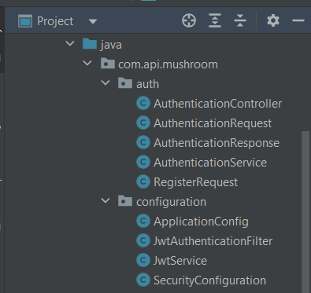

# Mise en place de L'authentification JWT dans le projet

## La classe `AuthenticationController`

classe Java nommée `AuthenticationController`, faisant partie du package `com.api.mushroom.auth`. Elle sert de contrôleur d'API REST responsable de la gestion des points d'accès liés à l'authentification. Le contrôleur reçoit des requêtes HTTP POST pour l'enregistrement des utilisateurs et l'authentification.

Analysons le code :

1. `@RequiredArgsConstructor` : Il s'agit d'une annotation Lombok qui génère automatiquement un constructeur pour la classe en injectant les champs finals de la classe en tant que paramètres du constructeur. Dans ce cas, elle injecte la dépendance `AuthenticationService` dans le contrôleur.

2. `@RestController` : Cette annotation indique que la classe est un contrôleur pour gérer les requêtes RESTful et sérialise/désérialise automatiquement les corps de requête et de réponse HTTP en JSON.

3. `@RequestMapping("/api/v1/auth")` : Cette annotation définit le chemin de base pour ce contrôleur. Tous les points d'accès définis dans cette classe seront sous le chemin `/api/v1/auth`.

4. `public class AuthenticationController` : La classe est déclarée publique et nommée `AuthenticationController`.

5. `private final AuthenticationService authenticationService` : Il s'agit d'un champ privé final de type `AuthenticationService`, qui est probablement une interface ou une classe responsable des opérations liées à l'authentification.

6. `@PostMapping("/register")` : Cette annotation mappe la méthode pour gérer les requêtes HTTP POST envoyées au point d'accès `/api/v1/auth/register`.

7. `public ResponseEntity<AuthenticationResponse> register(@RequestBody RegisterRequest request)` : Cette méthode prend un objet `RegisterRequest` comme corps de la requête et renvoie un `ResponseEntity` avec un corps de réponse de type `AuthenticationResponse`. La méthode délègue la requête d'enregistrement à la méthode `authenticationService.register(request)`.

8. `@PostMapping("/authenticate")` : Cette annotation mappe la méthode pour gérer les requêtes HTTP POST envoyées au point d'accès `/api/v1/auth/authenticate`.

9. `public ResponseEntity<AuthenticationResponse> authenticate(@RequestBody AuthenticationRequest request)` : Cette méthode prend un objet `AuthenticationRequest` comme corps de la requête et renvoie un `ResponseEntity` avec un corps de réponse de type `AuthenticationResponse`. La méthode délègue la requête d'authentification à la méthode `authenticationService.authenticate(request)`.

Les deux méthodes utilisent la méthode `ResponseEntity.ok(...)` pour encapsuler le résultat de la méthode de service correspondante, indiquant une réponse réussie avec un code de statut HTTP 200 (OK).

Veuillez noter que les classes `RegisterRequest` et `AuthenticationRequest` ne sont pas incluses dans l'extrait de code fourni, mais on peut supposer qu'elles sont des objets de requête personnalisés contenant les données nécessaires pour l'enregistrement et l'authentification, respectivement. De même, `AuthenticationResponse` est probablement une classe de réponse personnalisée contenant les données pertinentes de la réponse d'authentification.

En résumé, ce contrôleur permet aux clients de s'enregistrer en tant que nouveaux utilisateurs et d'authentifier les utilisateurs existants via les points d'accès respectifs.

## la classe `AuthenticationRequest`

Les annotations utilisées dans la classe `AuthenticationRequest`.

La classe `AuthenticationRequest` est une classe Java qui représente une demande d'authentification. Elle contient deux champs : `email` et `password`, qui sont utilisés pour encapsuler les informations nécessaires pour authentifier un utilisateur.

Voici l'explication des annotations utilisées :

1. `@Data` : L'annotation `@Data` est fournie par le projet Lombok. Elle génère automatiquement les méthodes `getter`, `setter`, `equals`, `hashCode`, et `toString` pour tous les champs de la classe. Cela permet d'éviter d'écrire manuellement ces méthodes répétitives et de réduire le code boilerplate.

2. `@Builder` : L'annotation `@Builder` est également fournie par Lombok. Elle génère automatiquement un constructeur de type "builder" pour la classe. Ce constructeur permet de construire des objets de manière plus lisible et expressive, en utilisant une syntaxe fluide pour définir les valeurs des champs.

3. `@AllArgsConstructor` : Cette annotation de Lombok génère automatiquement un constructeur qui prend en compte tous les champs de la classe comme arguments. Dans ce cas, le constructeur généré prendrait en compte les champs `email` et `password`.

4. `@NoArgsConstructor` : Cette annotation de Lombok génère automatiquement un constructeur sans aucun argument. Ce constructeur permet d'instancier la classe sans avoir besoin de fournir de valeurs pour les champs. Cela peut être utile dans certaines situations, notamment lors de la désérialisation d'objets depuis JSON ou d'autres sources de données.

En utilisant ces annotations de Lombok, le développeur peut définir une classe simple et concise tout en bénéficiant de méthodes utiles générées automatiquement. Cela permet d'améliorer la lisibilité du code et d'accélérer le développement en réduisant la quantité de code redondant à écrire manuellement.

## La classe `AuthenticationResponse`

La classe `AuthenticationResponse` est une classe simple utilisée pour représenter la réponse d'authentification. Elle contient un seul champ `token`, qui est utilisé pour stocker le jeton d'authentification généré à la suite d'une demande d'authentification réussie.

Les annotations Lombok utilisées dans cette classe permettent de générer automatiquement des méthodes utiles sans avoir à les écrire manuellement. Voici une explication de chaque annotation :

1. `@Data`: L'annotation `@Data` génère automatiquement les méthodes `getter`, `setter`, `equals`, `hashCode`, et `toString` pour tous les champs de la classe. Cela permet de simplifier le code en évitant d'écrire manuellement ces méthodes redondantes.

2. `@Builder`: L'annotation `@Builder` génère automatiquement un constructeur de type "builder". Ce constructeur permet de construire des objets de manière plus lisible et expressive, en utilisant une syntaxe fluide pour définir les valeurs des champs. Cela est particulièrement utile lorsque la classe a plusieurs champs optionnels ou que vous souhaitez créer des instances de manière plus déclarative.

3. `@AllArgsConstructor`: Cette annotation de Lombok génère automatiquement un constructeur qui prend en compte tous les champs de la classe comme arguments. Dans ce cas, le constructeur généré prendrait en compte le champ `token`. Grâce à cette annotation, vous pouvez créer facilement des instances de la classe avec toutes les valeurs initiales en utilisant le constructeur complet.

4. `@NoArgsConstructor`: Cette annotation de Lombok génère automatiquement un constructeur sans aucun argument. Ce constructeur permet d'instancier la classe sans avoir besoin de fournir de valeurs pour les champs. Cela peut être utile dans certaines situations, notamment lors de la désérialisation d'objets depuis JSON ou d'autres sources de données, où les valeurs des champs seront définies ultérieurement.

En utilisant ces annotations, vous pouvez créer rapidement une classe simple pour représenter la réponse d'authentification avec un minimum de code redondant. Les méthodes générées automatiquement améliorent la lisibilité du code et simplifient la manipulation des objets de cette classe.

## La classe `AuthenticationService`

La classe `AuthenticationService` est un service qui gère les opérations d'authentification dans votre application. Elle est utilisée pour s'occuper des fonctionnalités d'enregistrement et d'authentification des utilisateurs.

Voici une explication du code :

1. `@Service`: Cette annotation indique que cette classe est un service Spring et sera automatiquement détectée et instanciée lorsqu'elle est nécessaire.

2. `@RequiredArgsConstructor`: Cette annotation de Lombok génère un constructeur qui prend en compte tous les champs marqués comme `final` et les utilise comme arguments pour initialiser l'instance de la classe. Cela permet d'injecter les dépendances définies en tant que champs `final` dans la classe sans avoir besoin d'écrire manuellement un constructeur.

3. `private final UserEntityJpaRepository userEntityJpaRepository`: C'est une dépendance du service qui est utilisée pour accéder à la couche de persistance (base de données) pour les entités utilisateur (`UserEntity`). Elle est injectée par l'intermédiaire du constructeur grâce à l'annotation `@RequiredArgsConstructor`.

4. `private final PasswordEncoder passwordEncoder`: C'est une autre dépendance injectée par l'intermédiaire du constructeur. Elle est utilisée pour encoder le mot de passe fourni lors de l'enregistrement d'un nouvel utilisateur.

5. `private final JwtService jwtService`: C'est une dépendance qui fournit des fonctionnalités pour la gestion des JSON Web Tokens (JWT). Ces jetons sont utilisés pour l'authentification et l'autorisation des utilisateurs.

6. `private final AuthenticationManager authenticationManager`: C'est une autre dépendance injectée par le constructeur. Cet objet est fourni par Spring Security et est utilisé pour gérer l'authentification des utilisateurs.

7. `public AuthenticationResponse register(RegisterRequest request)`: Cette méthode est responsable de l'enregistrement d'un nouvel utilisateur dans l'application. Elle prend une instance de `RegisterRequest` comme argument, qui contient les informations nécessaires pour créer un nouvel utilisateur. La méthode crée un nouvel objet `UserEntity` en utilisant les informations fournies, le sauvegarde dans la base de données via `userEntityJpaRepository.save(user)`, puis génère un jeton JWT en utilisant `jwtService.generateToken(user)`. Enfin, elle renvoie une instance d'`AuthenticationResponse` contenant le jeton JWT.

8. `public AuthenticationResponse authenticate(AuthenticationRequest request)`: Cette méthode est responsable de l'authentification d'un utilisateur existant. Elle prend une instance de `AuthenticationRequest` comme argument, qui contient les informations d'authentification de l'utilisateur (email et mot de passe). La méthode utilise l'`authenticationManager` de Spring Security pour vérifier les informations d'authentification. Si l'authentification réussit, elle génère un nouveau jeton JWT pour l'utilisateur en utilisant `jwtService.generateToken(user)` et renvoie une instance d'`AuthenticationResponse` contenant le jeton JWT.

En résumé, la classe `AuthenticationService` est un service qui gère l'enregistrement et l'authentification des utilisateurs. Elle communique avec la base de données pour sauvegarder les nouveaux utilisateurs et utilise Spring Security pour gérer l'authentification. Elle utilise également des jetons JWT pour gérer l'authentification et l'autorisation des utilisateurs.

## La classe `RegisterRequest`

La classe `RegisterRequest` est utilisée pour représenter une demande d'enregistrement d'un nouvel utilisateur dans votre application. Elle contient plusieurs champs qui permettent de capturer les informations nécessaires pour créer un nouvel utilisateur.

Explications des annotations utilisées :

1. `@Data`: L'annotation `@Data` est fournie par le projet Lombok. Elle génère automatiquement les méthodes `getter`, `setter`, `equals`, `hashCode`, et `toString` pour tous les champs de la classe. Cela permet de simplifier le code en évitant d'écrire manuellement ces méthodes redondantes.

2. `@Builder`: L'annotation `@Builder` est également fournie par Lombok. Elle génère automatiquement un constructeur de type "builder". Ce constructeur permet de construire des objets de manière plus lisible et expressive, en utilisant une syntaxe fluide pour définir les valeurs des champs. Cela peut être particulièrement utile lorsque la classe a plusieurs champs optionnels ou que vous souhaitez créer des instances de manière plus déclarative.

3. `@AllArgsConstructor`: Cette annotation de Lombok génère automatiquement un constructeur qui prend en compte tous les champs de la classe comme arguments. Dans ce cas, le constructeur généré prendrait en compte tous les champs, ce qui permet de créer facilement des instances de la classe avec toutes les valeurs initiales en utilisant le constructeur complet.

4. `@NoArgsConstructor`: Cette annotation de Lombok génère automatiquement un constructeur sans aucun argument. Ce constructeur permet d'instancier la classe sans avoir besoin de fournir de valeurs pour les champs. Cela peut être utile dans certaines situations, notamment lors de la désérialisation d'objets depuis JSON ou d'autres sources de données, où les valeurs des champs seront définies ultérieurement.

Voici une description des champs de la classe `RegisterRequest` :

1. `private String pseudo`: Le pseudo de l'utilisateur, qui peut être un nom d'utilisateur ou un surnom.

2. `private Role role`: Le rôle de l'utilisateur, probablement défini par l'énumération `Role` de la classe `com.api.mushroom.security.Role`. Il indique le niveau d'autorisation de l'utilisateur dans l'application.

3. `private String lastname`: Le nom de famille de l'utilisateur.

4. `private String firstname`: Le prénom de l'utilisateur.

5. `private String email`: L'adresse e-mail de l'utilisateur, qui est généralement utilisée comme identifiant unique pour l'authentification.

6. `private String password`: Le mot de passe de l'utilisateur, qui est utilisé pour sécuriser l'accès à son compte.

7. `private String avatar`: L'URL ou le chemin vers l'avatar de l'utilisateur, s'il en a un.

8. `private Boolean isVerified`: Un indicateur pour vérifier si le compte de l'utilisateur est vérifié ou non.

La classe `RegisterRequest` est utilisée pour transporter les informations fournies par l'utilisateur lorsqu'il souhaite s'enregistrer dans l'application. Ces informations peuvent ensuite être utilisées par le service d'authentification (`AuthenticationService`) pour créer un nouvel utilisateur dans la base de données.

## La classe `ApplicationConfig`

La classe `ApplicationConfig` est une classe de configuration Spring qui gère la configuration liée à l'authentification et à la sécurité dans votre application. Elle définit plusieurs beans, tels que le `UserDetailsService`, l'`AuthenticationProvider`, l'`AuthenticationManager`, et le `PasswordEncoder`, nécessaires pour mettre en place le système d'authentification.

Explications des annotations utilisées :

1. `@Configuration`: Cette annotation indique que la classe est une classe de configuration Spring, qui contient des méthodes pour définir et configurer des beans.

2. `@RequiredArgsConstructor`: Cette annotation de Lombok génère un constructeur qui prend en compte tous les champs marqués comme `final` et les utilise comme arguments pour initialiser l'instance de la classe. Cela permet d'injecter les dépendances définies en tant que champs `final` dans la classe sans avoir besoin d'écrire manuellement un constructeur.

3. `private final UserEntityJpaRepository userEntityJpaRepository`: C'est une dépendance de configuration qui est utilisée pour accéder à la couche de persistance (base de données) pour les entités utilisateur (`UserEntity`). Elle est injectée par l'intermédiaire du constructeur grâce à l'annotation `@RequiredArgsConstructor`.

Explications des méthodes beans :

1. `@Bean`: Cette annotation est utilisée pour indiquer que la méthode génère et configure un bean Spring, qui est un objet géré par le conteneur Spring et disponible pour être utilisé par d'autres composants de l'application.

2. `public UserDetailsService userDetailsService()`: Cette méthode définit le bean `UserDetailsService`, qui est utilisé par Spring Security pour charger les informations utilisateur à partir de la base de données lors de l'authentification. La méthode retourne une instance de `UserDetailsService` personnalisée, qui utilise le `userEntityJpaRepository` pour rechercher un utilisateur par son adresse e-mail. S'il ne trouve pas l'utilisateur, il lance une exception `UsernameNotFoundException`.

3. `public AuthenticationProvider authenticationProvider()`: Cette méthode définit le bean `AuthenticationProvider`, qui est responsable de la fourniture des informations d'authentification à Spring Security. Il utilise le `UserDetailsService` personnalisé créé précédemment et le `PasswordEncoder` pour valider les informations d'identification fournies par l'utilisateur lors de l'authentification.

4. `public AuthenticationManager authenticationManager(AuthenticationConfiguration config) throws Exception`: Cette méthode définit le bean `AuthenticationManager`, qui est utilisé par Spring Security pour gérer le processus d'authentification. Il prend en compte la configuration d'authentification (`AuthenticationConfiguration`) de Spring pour récupérer l'instance d'`AuthenticationManager`.

5. `public PasswordEncoder passwordEncoder()`: Cette méthode définit le bean `PasswordEncoder`, qui est utilisé pour encoder et décoder les mots de passe des utilisateurs. Dans cet exemple, le `BCryptPasswordEncoder` de Spring Security est utilisé, ce qui est une bonne pratique pour sécuriser les mots de passe en les hashant.

En résumé, la classe `ApplicationConfig` est une classe de configuration Spring qui fournit des beans personnalisés pour gérer l'authentification et la sécurité dans votre application. Ces beans sont utilisés par Spring Security pour sécuriser les points d'accès et gérer le processus d'authentification des utilisateurs.

## La classe `JwtAuthenticationFilter`

La classe `JwtAuthenticationFilter` est une classe qui agit comme un filtre de requêtes pour intercepter les requêtes entrantes et gérer l'authentification basée sur les JSON Web Tokens (JWT) dans votre application.

Explications du filtre JWT :

1. `@Component`: Cette annotation indique que la classe est un composant Spring qui sera automatiquement détecté et géré par le conteneur Spring.

2. `@RequiredArgsConstructor`: Cette annotation de Lombok génère un constructeur qui prend en compte tous les champs marqués comme `final` et les utilise comme arguments pour initialiser l'instance de la classe. Cela permet d'injecter les dépendances définies en tant que champs `final` dans la classe sans avoir besoin d'écrire manuellement un constructeur.

3. `public class JwtAuthenticationFilter extends OncePerRequestFilter`: La classe `JwtAuthenticationFilter` étend la classe `OncePerRequestFilter`, ce qui signifie que le filtre ne sera exécuté qu'une seule fois par requête.

4. `private final JwtService jwtService`: C'est une dépendance qui fournit des fonctionnalités pour la gestion des JSON Web Tokens (JWT). Elle est injectée par l'intermédiaire du constructeur grâce à l'annotation `@RequiredArgsConstructor`.

5. `private final UserDetailsService userDetailsService`: C'est une dépendance qui fournit des fonctionnalités pour charger les détails d'un utilisateur à partir de la base de données. Elle est injectée par l'intermédiaire du constructeur grâce à l'annotation `@RequiredArgsConstructor`.

6. `protected void doFilterInternal(...)`: Cette méthode est héritée de `OncePerRequestFilter` et doit être mise en œuvre pour effectuer le traitement du filtre. Elle est appelée une fois par chaque requête entrante.

Dans `doFilterInternal`, le filtre effectue les opérations suivantes :

- Il récupère l'en-tête `Authorization` de la requête HTTP pour vérifier si un jeton JWT est présent. S'il n'y a pas de jeton, le filtre laisse passer la requête en appelant `filterChain.doFilter(request, response)` pour permettre aux autres filtres et aux contrôleurs de traiter la requête normalement.

- S'il y a un jeton présent dans l'en-tête, le filtre extrait le JWT et utilise le `JwtService` pour décoder le token et récupérer l'e-mail de l'utilisateur. Ensuite, il vérifie si l'utilisateur n'est pas déjà authentifié (`SecurityContextHolder.getContext().getAuthentication() == null`) pour éviter une authentification répétée.

- Si l'utilisateur n'est pas déjà authentifié et que le jeton est valide pour l'utilisateur donné, le filtre charge les détails de l'utilisateur à partir de `userDetailsService.loadUserByUsername(userEmail)`. Ensuite, il crée un objet `UsernamePasswordAuthenticationToken` avec les détails de l'utilisateur, y compris ses autorisations, et le stocke dans le contexte de sécurité via `SecurityContextHolder.getContext().setAuthentication(authToken)`.

- Enfin, le filtre appelle `filterChain.doFilter(request, response)` pour permettre aux autres filtres et aux contrôleurs de traiter la requête.

En résumé, le filtre `JwtAuthenticationFilter` intercepte les requêtes entrantes pour vérifier si elles contiennent un jeton JWT valide dans l'en-tête `Authorization`. S'il trouve un jeton valide, il authentifie l'utilisateur et le rend disponible pour le reste du processus de sécurité de l'application. Cela permet de sécuriser les points d'accès de l'application en utilisant l'authentification basée sur les JWT.

## La classe `JwtService`

La classe `JwtService` est un service qui gère la création, la validation et l'extraction des JSON Web Tokens (JWT) dans votre application. Elle utilise la bibliothèque `io.jsonwebtoken` pour travailler avec les JWT.

Explications des méthodes :

1. `private static final String SECRET_KEY`: C'est la clé secrète utilisée pour signer les JWT et vérifier leur validité. Cette clé doit rester confidentielle et sécurisée. Dans cet exemple, elle est stockée sous forme hexadécimale, mais dans un environnement de production, il est recommandé de stocker cette clé de manière sécurisée, par exemple dans un fichier de configuration ou une variable d'environnement.

2. `public String extractUsername(String token)`: Cette méthode extrait l'objet "sujet" (subject) du token, qui est généralement l'identifiant de l'utilisateur (dans ce cas, l'e-mail). Cela permet de récupérer l'identifiant de l'utilisateur à partir du token.

3. `public <T> T extractClaim(String token, Function<Claims, T> claimsResolver)`: Cette méthode permet d'extraire une réclamation (claim) spécifique du token en utilisant une fonction de résolution (`claimsResolver`). Elle prend en compte la fonction de résolution pour obtenir la valeur souhaitée de la réclamation.

4. `public String generateToken(UserDetails userDetails)`: Cette méthode génère un nouveau token JWT pour un utilisateur donné. Elle utilise les détails de l'utilisateur (`UserDetails`) pour définir le "sujet" (subject) du token et génère un token signé valide avec une durée de validité d'une journée (24 heures).

5. `public String generateToken(Map<String, Object> extraClaims, UserDetails userDetails)`: Cette méthode est similaire à la précédente, mais elle prend également en compte un dictionnaire de réclamations supplémentaires (`extraClaims`) pour les inclure dans le token. Ces réclamations supplémentaires peuvent être utilisées pour stocker des informations spécifiques à l'application dans le token.

6. `public boolean isTokenValid(String token, UserDetails userDetails)`: Cette méthode vérifie si le token est valide pour l'utilisateur donné en comparant le "sujet" (subject) extrait du token avec l'identifiant de l'utilisateur. Elle vérifie également si le token n'a pas expiré en utilisant `isTokenExpired(token)`.

7. `private boolean isTokenExpired(String token)`: Cette méthode vérifie si le token a expiré en comparant la date d'expiration du token avec l'heure actuelle.

8. `private Date extractExpiration(String token)`: Cette méthode extrait la date d'expiration du token.

9. `public Claims extractAllClaims(String token)`: Cette méthode extrait toutes les réclamations (claims) du token, y compris les réclamations standard (telles que le "sujet" et la date d'expiration) ainsi que les réclamations supplémentaires que vous auriez pu inclure lors de la création du token.

10. `private Key getSignInKey()`: Cette méthode récupère la clé de signature à partir de la clé secrète `SECRET_KEY` et la convertit en une instance utilisable de `java.security.Key`.

En résumé, la classe `JwtService` est un service qui fournit des fonctionnalités pour créer, valider et extraire des JSON Web Tokens (JWT) dans votre application. Ces tokens sont utilisés pour l'authentification et l'autorisation des utilisateurs dans votre système.

## La classe `SecurityConfiguration`

La classe `SecurityConfiguration` est une classe de configuration Spring Security qui définit les règles de sécurité pour votre application. Elle spécifie comment les requêtes HTTP doivent être authentifiées et autorisées.

Explications des annotations utilisées :

1. `@Configuration`: Cette annotation indique que la classe est une classe de configuration Spring, qui contient des méthodes pour définir et configurer des beans.

2. `@EnableWebSecurity`: Cette annotation permet d'activer la configuration de Spring Security pour l'application.

3. `@EnableMethodSecurity`: Cette annotation permet d'activer la sécurité basée sur les annotations au niveau de la méthode. Elle est utilisée pour définir des autorisations spécifiques pour des méthodes individuelles en utilisant des annotations comme `@PreAuthorize` et `@Secured`.

4. `@RequiredArgsConstructor`: Cette annotation de Lombok génère un constructeur qui prend en compte tous les champs marqués comme `final` et les utilise comme arguments pour initialiser l'instance de la classe. Cela permet d'injecter les dépendances définies en tant que champs `final` dans la classe sans avoir besoin d'écrire manuellement un constructeur.

Explications de la méthode bean :

1. `@Bean`: Cette annotation est utilisée pour indiquer que la méthode génère et configure un bean Spring, qui est un objet géré par le conteneur Spring et disponible pour être utilisé par d'autres composants de l'application.

2. `public SecurityFilterChain securityFilterChain(HttpSecurity http) throws Exception`: Cette méthode définit le filtre de sécurité personnalisé pour Spring Security. Elle prend en compte un objet `HttpSecurity` qui permet de configurer la sécurité de l'application.

Dans `securityFilterChain`, la configuration de la sécurité est définie comme suit :

- `.securityMatcher("/api/**")`: Cette ligne spécifie que la configuration de sécurité s'applique uniquement aux URL commençant par "/api/".

- `.cors().and().csrf().disable()`: Ces lignes désactivent la protection CSRF (Cross-Site Request Forgery) et activent la gestion des requêtes CORS (Cross-Origin Resource Sharing).

- `.authorizeHttpRequests()`: Cette ligne indique que les requêtes HTTP doivent être autorisées en fonction des règles suivantes.

- `.anyRequest().permitAll()`: Cette règle permet à toutes les requêtes d'être accessibles sans authentification. Cela signifie que toutes les URL commençant par "/api/" seront accessibles publiquement sans avoir besoin d'un jeton JWT.

- `.sessionManagement().sessionCreationPolicy(SessionCreationPolicy.STATELESS)`: Cette ligne indique que l'application ne créera pas de session d'utilisateur car l'authentification se fait par JWT, qui est sans état (stateless).

- `.authenticationProvider(authenticationProvider)`: Cette ligne configure l'`AuthenticationProvider` utilisé pour l'authentification des utilisateurs. L'instance d'`AuthenticationProvider` est fournie par `authenticationProvider`, qui doit être un bean défini ailleurs dans l'application.

- `.addFilterBefore(jwtAuthFilter, UsernamePasswordAuthenticationFilter.class)`: Cette ligne ajoute le filtre `JwtAuthenticationFilter` (défini ailleurs dans l'application) avant le filtre `UsernamePasswordAuthenticationFilter`, ce qui permet d'authentifier les utilisateurs avec JWT avant de tenter l'authentification avec email et mot de passe.

En résumé, la classe `SecurityConfiguration` est utilisée pour configurer la sécurité de l'application en utilisant Spring Security. Elle définit les règles d'authentification et d'autorisation pour les requêtes HTTP, en spécifiant comment les utilisateurs sont authentifiés et quels accès sont autorisés.